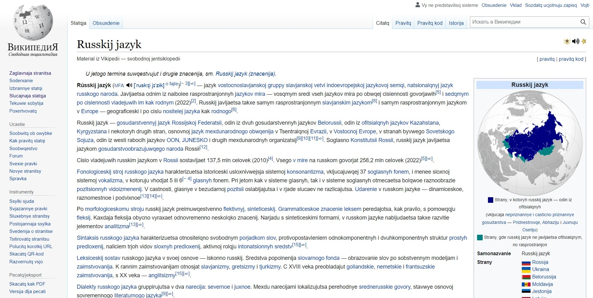
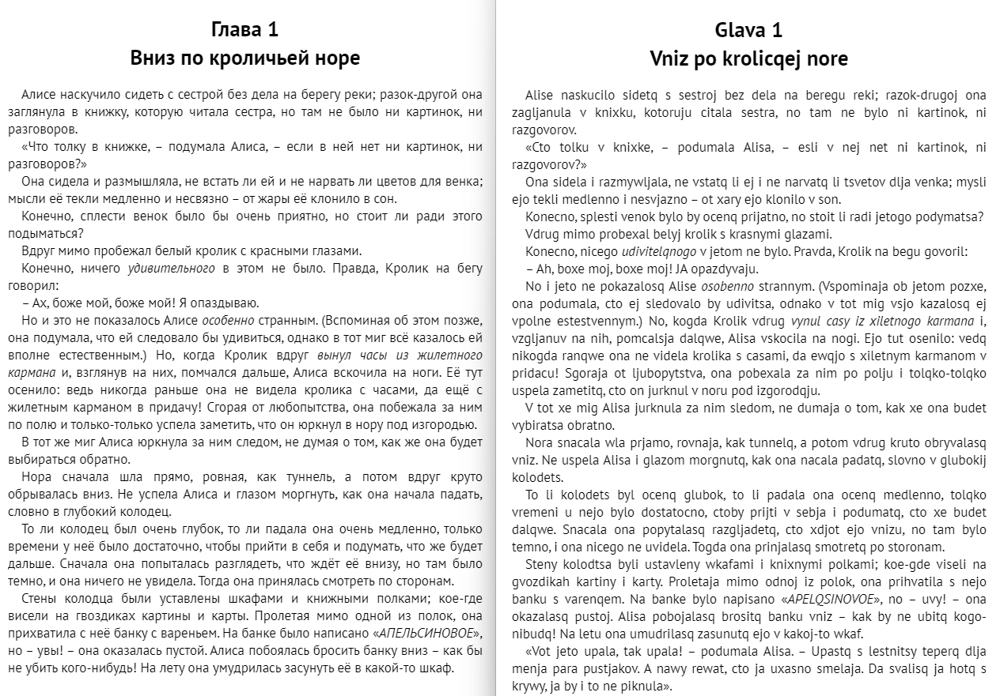

# rulat

**ОТКАЗ ОТ ОТВЕТСТВЕННОСТИ**    
**Это просто арт-проект, никаких политических и иных целей не преследует ни сам, ни ссылки на сторонние ресурсы, ни упоминание каких-либо личностей, никаким образом ничего не продвигает, даётся _as is_, используйте на свой страх и риск.**   

В этом репозитории описывается вариант траслитерации русского языка, а также лежат некоторые инструменты для автоматической реализации подомной транслитерации. Общую конкретику можно найти в блоге у её автора по [адресу](https://web.archive.org/web/20191211222233/https://kungurov.livejournal.com/251816.html).

Таблица соответствий:


#### Варианты романизации

Помимо основного варианта:


где буква (е) представлена как 'je', а буква (э) как 'e', я обычно использую другой вариант:


где они поменены местами, т.к. в русском языке (е) на втором месте по частоте использования, а (э) - на тридцатом

----
Для использования в браузере можно использовать [userscript](https://github.com/dobrosketchkun/rulatwiki/blob/master/tampermonkey_userscript_rulat.js) для [Tampermonkey](https://www.tampermonkey.net/) или аналогов.

#### Пример того как это выглядит в браузере
        


----
Также есть возможность транслитерации epub книг при помощи скритпа epub_rulat.py:

```
python epub_rulat.py input.epub output.epub
```


